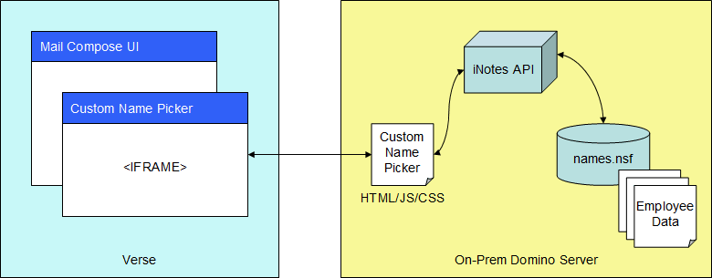

# Custom Name Picker with Advanced Search

## 1. Overview

This is a sample code for Custom Name Picker in IBM Verse on-Cloud and on-Premise.

Custom Name Picker works with an extension point "com.ibm.verse.custom.name.picker" in IBM Verse. The sample code is written with HTML, JavaScript and CSS. Files should be located in on-Premise Domino Server. The sample code retrieves employee information from Domino Directory through iNotes XML API.




## 2. Configure on-Premise Domino Server

Custom Name Picker connects to an on-Premise Domino Server by means of HTTPS. Domino Web server must be running. HTTPS must be configured.


## 3. Extend Domino Directory

To get employee information, a new view needs to be added to Domino Directory. Please add the following view to a Domino Directory by using Domino Designer, then create a full-text index of the Domino Directory.

| Design element    |                   | Detail                     |
|:------------------|:------------------|:---------------------------|
| View name         |                   | ($CustomNamePicker_Search) |
| Selection Formula |                   | SELECT (Type = "Person" 	&#124; Type = "Group") & @IsUnavailable($Conflict) & (!@IsAvailable($AutoCreatedList) &#124; !@UpperCase($AutoCreatedList)  = "DIP") |
| Column #1         | Title             | MAMailAddress |
|                   | Programmatic name | MAMailAddress |
|                   | Formula           | @If(Type = "Person"; @If(MailSystem="100"; ""; MailAddress!=""; MailAddress; @Subset(FullName;1) != ""; @Subset(FullName; 1); @If(FirstName!=""; FirstName+" "+LastName; LastName ) ); Type = "Database"; @Subset(FullName; 1); Type = "Group" & (GroupType="0":"1"&#124; @IsUnavailable(GroupType)); @Subset(ListName;1); "") |
| Column #2         | Title             | AltFullName |
|                   | Programmatic name | AltFullName |
|                   | Formula           | AltFullName |
| Column #3         | Title             | AltFullNameSort |
|                   | Programmatic name | AltFullNameSort |
|                   | Formula           | AltFullNameSort |
| Column #4         | Title             | InternetAddress |
|                   | Programmatic name | InternetAddress |
|                   | Formula           | @If(Type = "Person"; @If(MailSystem="100"; ""; InternetAddress); Type = "Database"; @Subset(FullName; 1); Type = "Group" & (GroupType="0":"1"&#124; @IsUnavailable(GroupType)); @Subset(ListName;1); "") |
| Column #5         | Title             | JobTitle |
|                   | Programmatic name | JobTitle |
|                   | Formula           | JobTitle |
| Column #6         | Title             | Department |
|                   | Programmatic name | Department |
|                   | Formula           | Department |
| Column #7         | Title             | Location |
|                   | Programmatic name | Location |
|                   | Formula           | Location |


## 4. Deploy Custom Name Picker files

The sample code for the Custom Name Picker is composed of HTML, JavaScript and CSS files. These files need to be copied to a new directory "custom-name-picker" under the existing folder "domino\html" in Domino data directory.

* index.html
* ui.js
* io.js
* style.css
* person.png


To use Custom Name Picker in Verse on-Premise, you need to add your on-Premise Verse server's host name here in ui.js.

```[
var originsList = [
  "https://mail.notes.na.collabserv.com",
  "https://mail.notes.ap.collabserv.com",
  "https://mail.notes.ce.collabserv.com"
];
```


## 5. Register/Install the extension

* To use Custom Name Picker in Verse on-Cloud and on-Premise on your personal client, register through Verse Developer browser extension. Please refer [Tutorial](https://ibmverse.github.io/verse-developer/developers/#get-started).

* To use Custom Name Picker for organization,
    - For Verse on-Cloud, register with use of IBM App Registry. Please refer section *"Deploy application on Verse on-Cloud"* of [Registering an Application in IBM Verse](https://ibmverse.github.io/verse-developer/developers/#registering-an-application-in-ibm-verse).
    - For Verse on-Premise, register through Verse on-Premise Extensibility. Please refer section *"Deploy application on Verse on-Premise"* of [Registering an Application in IBM Verse](https://ibmverse.github.io/verse-developer/developers/#registering-an-application-in-ibm-verse).

* Use this "application.json" for registration. Replace the host name "xxx.com" in the URL "https://xxx.com/custom-name-picker/index.html" with your Domino server's host name.

```
  {
    "name": "Custom name picker with advanced search",
    "title": "Custom name picker with advanced search",
    "description": "Add a custom name picker with advanced search which uses on-Premise Domino to find people, open mail compose and click To link to open this.",
    "extensions": [
      {
        "type": "com.ibm.verse.ext.namePicker",
        "name": "Custom name picker with advanced search",
        "payload": {
          "url": "https://xxx.com/custom-name-picker/index.html"
        }
      }
    ],
    "services": [
      "Verse"
    ]
  }
```


## 6. Test in stand-alone mode

* Open Google Chrome and open Domino Directory (typically names.nsf) in the On-Prem Domino server. Make sure that Domino Web server is up and running.
* Test HTTPS and HTTP access
* Open Custom Name Picker and verify that it works.

<https://xxx.com/custom-name-picker/index.html>


## 7. Test with Chrome browser extension

* Open Google Chrome and log on IBM Verse.
* Click "Compose" to create a new message. 
* Click the "To" link to open Custom Name Picker.


* You can search people by Kanji name, phonetic name, or Notes name.
* You can click the "Detail" button and search people by job title, department, location, and Internet address.
* You can double-click on a name card to insert the name to recipient field.


## 8. License

[MIT licensed](./license.txt)
